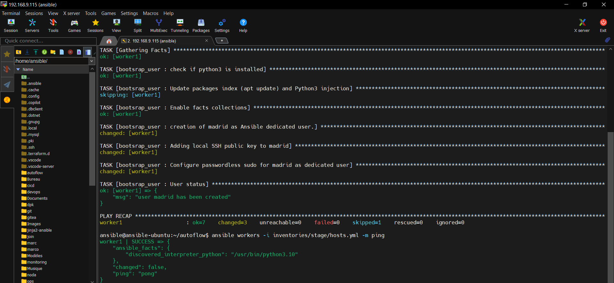

🚧 Project Status: Under Development

This project is currently under development. Documentation, features, and configurations may be updated as the project progresses.

<h1 align="center"> Partie 1: internal-apt-patch-management-with-private-repo-ansible-jinja2-reprepro </h1>

## Problem statement 

Linux package management is an important security and operational component of an IT environment, contributing to the stability, reliability, and proper functioning of its systems.

Linux packages often require specific dependencies to function correctly. Allowing client machines to install packages directly from external sources such as the Internet can introduce security and operational risks if package sources, versions, integrity, and dependencies are not properly controlled.

To address this challenge, an IT environment can implement a private internal package repository that provides client machines with the required packages and dependencies from a controlled source.

This approach allows client machines to perform package updates and patch management through the internal repository without directly depending on external package repositories. It provides greater control over package sources and distribution while establishing a more consistent and traceable package management process across the IT environment.

---

## Purpose

Automate package installation and patch management by enabling client machines to retrieve required packages and their dependencies from a private internal repository rather than directly from external sources such as the Internet

---

## Project Execution Environment

This project will be executed on linux environment using: 

    1. Linux as the operating system
    2. Ansible for automation and configuration management
    3. Reprepro to create and manage a private internal APT repository

---

## Project Workflow

Presentation of project workflow:


```text
                  OFFICIAL APT REPOSITORY
                   (Linux Distribution)
                            │
                            │ Component: main
                            ▼
                   Package Selection
                            │
                            ▼
                 Dependency Resolution
                            │
                            ▼
              ┌──────────────────────────┐
              │   PRIVATE APT SERVER     │
              │        Reprepro          │
              │                          │
              │   Internal APT Repository│
              └────────────┬─────────────┘
                           │
                           │ APT
                           ▼
                ┌────────────────────────┐
                │      LINUX CLIENTS     │
                │                        │
                │  Staging / Production  │
                └───────────▲────────────┘
                            │
                            │
                 Configuration & Patching
                            │
                    ┌───────┴───────┐
                    │    Ansible    │
                    └───────────────┘
```

As stated in the Purpose section:
Linux client machines are configured to retrieve packages from the private repository. Ansible automates client configuration and patch management across the staging and production environments. For this project, the main component of the official APT repository will be used as the package source.

---

## Project Structure

```text
autoflow_/                 
├── helper/                         # Guide for configuring ansible.cfg
|   └── ansible.cfg.txt                              
├── Images/                         # project screenshots
├── inventories/                    # Ansible inventories used to manage the different environments (stage and prod)
|   ├── group_vars/
|   ├── prod/   
|   └── stage/ 
├── logs/                           # Ansible logs store during playbook execution
|   
├── playbooks/                      # Playbook directory with files to manage project ansible roles
|   └── autoflow_manage.yml
├── roles/                          # modular Ansible roles that implement the main configuration and management tasks
|   ├── bootsrap_user/
|   ├── packages/
|   └── ssh_hardening/     
├── .gitignore                      # Defines files and directories that should not be tracked by Git              
├── ansible.cfg                     # Defines the project's Ansible configuration (inventory, roles, ssh, privilege escalation)
└── README.md                       # Provides an overview of the project (problem statement,purpose, workflow, etc...)
                  

```

## Physical architecture

The physical architecture is not fixed and may evolve as the project progresses.

Presentation:

                         INTERNET
                            │
                            │
                  Official APT Repository
                       Component: main
                            │
                            │
                            ▼
                 ┌──────────────────────┐
                 │   LOCAL APT REPO     │
                 │       SERVER         │
                 │      Reprepro        │
                 │                      │
                 │ Approved packages    │
                 │ + dependencies       │
                 └──────────┬───────────┘
                            │
                     Private APT
                     Repository
                            │
                ┌───────────┴───────────┐
                │                       │
                ▼                       ▼
        ┌──────────────┐        ┌──────────────┐
        │ Linux Client │        │ Linux Client │
        │   STAGING    │        │ PRODUCTION   │
        └──────────────┘        └──────────────┘
                ▲                       ▲
                │                       │
                └───────────┬───────────┘
                            │
                       Configuration
                       & Patch Management
                            │
                     ┌──────┴──────┐
                     │   Ansible   │
                     │ Control Node│
                     └─────────────┘

              🚫 Clients → Internet

Please, follow this link to set up and configure private local repository:

👉 [Private local repository seting up](https://github.com/jeanmarctsh/http-linux-local-repository)

---

## Architecture Components

| Component                        | Purpose                                                                                |
| -------------------------------- | -------------------------------------------------------------------------------------- |
| **Official APT Repository**      | Provides official Linux packages from the `main` component.                            |
| **Local Private APT Repository** | Retrieves and stores the required packages and dependencies for internal distribution. |
| **Linux Client Machines**        | Install and update packages exclusively from the local private repository.             |
| **Ansible Control Node**         | Automates client configuration and patch management.                                   |
| **Staging / Production**         | Provides isolated environments for managed Linux clients.                              |


## Package Management Policy

Linux client machines have no direct access to external package repositories. APT is configured to use the local private repository as the only package source for installation and updates.

The local repository server is the only component responsible for retrieving packages from the authorized external APT source.

---

<h1 align="center"> Partie 2: Ansible Command Execution </h1>

Before executing any Ansible commands, make sure the following prerequisites are in place:

    1. Control node 

        - Ansible installed
        - IP Address configured
        - OpenSSH client installed
        - SSH key pair (public and private key)
    
    2. Managed node

        - IP address configured
        - Python 3 installed
        - OpenSSH server installed

## Create dedicated user and Test Connectivity 

Test connectivity between the Ansible control node and managed Linux clients

```bash
# Create dedicated user
ansible-playbook -i inventories/stage/hosts.yml playbooks/autoflow_manage.yml --tags "user" --limit "workers" -u worker4 -k -K

# Test Connectivity 
ansible workers -i inventories/stage/hosts.yml -m ping
```

## Output of the command



---

## ✍️ AUTEUR
- Nom : Ngandu Jean-Marc
- [](mailto:jeanmarctshimbombo@gmail.com)
- [](https://www.linkedin.com/in/jean-marc-ngandu-b60796222)
- [](https://github.com/jeanmarctsh)


